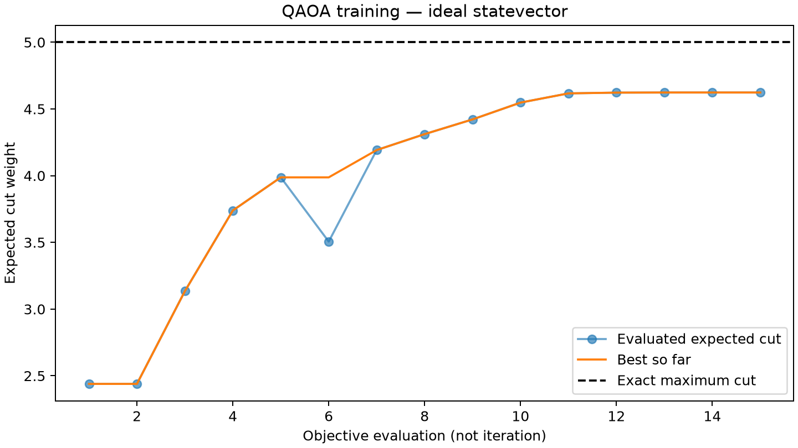

# QAOA Query Optimization Lab

A Python/PennyLane research prototype exploring QAOA for Max-Cut and small,
synthetic database join-order problems, with a local interactive web dashboard.

## Quick start

### Streamlit app

After installing the requirements below, run:

```sh
.venv312/bin/python -m streamlit run streamlit_app.py
```

For Streamlit Community Cloud, select this repository, branch `main`, entry point
`streamlit_app.py`, and Python 3.12. No secrets or API keys are required.
The shared demo supports Max-Cut, the three-table example and two four-qubit
valid-plan modes. Depth is capped at 2, optimizer budget at 100, and samples at
2,000. A process-wide lock admits one run at a time; each run uses a subprocess
with a 120-second timeout. Results are session-local, not durable.
The original local dashboard retains all six modes, including the 10-qubit QUBOs.

### Original local dashboard

Tested with Python 3.12. From the repository directory:

```sh
python3.12 -m venv .venv312
.venv312/bin/python -m pip install -r requirements.txt
.venv312/bin/python -m unittest discover -v
.venv312/bin/python dashboard.py
```

Open http://127.0.0.1:8765. Choose a problem and QAOA depth, run training,
and inspect solution probabilities, sampled outcomes, and exact comparisons.
The dashboard is for local use, not public deployment.

## Architecture

The HTML/CSS/JavaScript frontend calls a Python HTTP API. The service layer
builds QUBO/Ising problems, trains PennyLane circuits with classical optimizers,
and evaluates results against exhaustive classical solutions.

| Component | Files |
| --- | --- |
| Dashboard and API | `web/`, `dashboard.py`, `dashboard_service.py` |
| Problem encodings | `problem.py`, `qubo.py`, `join_problem.py` |
| Quantum circuits and training | `ansatz.py`, `feasible_join.py`, `train.py` |
| Evaluation and benchmarks | `evaluate.py`, `experiment.py`, `benchmark_join.py`, `compare_feasibility.py` |
| Verification | `test_*.py` |

## Scope and research status

This is an ideal-simulator educational/research baseline, not a production SQL
optimizer or a universal optimizer. Join costs are synthetic; join experiments
use three or four tables. No quantum advantage or original research contribution
has been established. The valid-plan approach enumerates all plans classically
before quantum training, so classical enumeration already supplies the optimum.
Timing comparisons are illustrative, not evidence of quantum speedup.

Literature attribution and reproduction boundaries are in [REPLICATION.md](REPLICATION.md).
Saved example results are included in `results/`; timings depend on the machine.



## Experiment guide

New: [valid-plan experiment and classical comparisons](FEASIBILITY_RESULTS.md).
The dashboard includes two experimental four-table valid-plan mixer modes.
These classically enumerate the full plan set first; they demonstrate validity
preservation, not a scalable quantum speedup.

## Local web dashboard

```sh
.venv312/bin/python dashboard.py
```

Open http://127.0.0.1:8765 in your browser. The frontend is in `web/`, the
HTTP API is in `dashboard.py`, and `dashboard_service.py` connects it to the
existing research modules. No additional dependencies are needed.
Select Max-Cut or a three/four-table join problem, choose depth, optimizer,
seeds and sample count, then run an experiment and download the complete JSON.
The page shows status, energy history, outcome probabilities and sampled counts.

The server listens on loopback only and processes one experiment at a time.
It has no accounts, public hosting, real SQL integration or durable database.
The latest 20 runs are kept in server memory; restarting discards them, and
refreshing the page clears its current result. Download results before leaving.
Join runs normalize cost evolution and objective by the penalty. Their angles
are not directly comparable with the unnormalized three-table replication.

The first partial join-order literature replication is documented in
[REPLICATION.md](REPLICATION.md). It reproduces an explicit three-relation
QUBO and adds a separate 20-run ideal QAOA experiment. It does not reproduce
the selected paper's full evaluation or establish novelty.

The next synthetic benchmark is in `benchmark_join.py`, with independent
binary-tree enumeration in `join_problem.py`. It checks four-table QUBOs
against all 15 unordered binary join trees and all 1,024 bitstrings. Run:

```sh
.venv312/bin/python benchmark_join.py --output results/four_table_repeat/report.json
```

It compares two positive-cost instances, two penalty choices, depths 1 and 2,
and three seeds (24 ideal-simulator runs). This is not an author-benchmark
replication. Root cost is assumed constant and omitted; costs are synthetic.
The full unsplit encoding uses 10 qubits. Both the cost evolution and measured
objective are divided by the penalty to control global scale. Reported angles
belong to that normalized Hamiltonian. Zero costs are rejected because they
can allow invalid ground-state ties. See `FOUR_TABLE_RESULTS.md` for findings.

Python 3.10+; the local verification environment uses Python 3.12.

```sh
python3.12 -m venv .venv312
.venv312/bin/python -m pip install -r requirements.txt
.venv312/bin/python problem.py
```

`make_graph()` creates a five-cycle plus chord (0, 2).
`from_adjacency()` accepts a symmetric, nonnegative weighted adjacency matrix
and returns a PennyLane cost operator and a symmetric QUBO matrix.
Row i maps to wire i; printed bitstrings have wire 0 on the left.

For a bitstring x, the cut weight is
C(x) = sum over i < j of A[i,j] (x[i] + x[j] - 2 x[i] x[j]).
We minimize negative cut weight:

- Q = A - diag(A @ 1), using E(x) = x.T @ Q @ x.
- H_C = sum over i < j of A[i,j] (Z_i Z_j - I) / 2.

Both halves of the symmetric Q matrix contribute to the quadratic terms.
The constant identity term is retained so energy equals negative cut weight
exactly. Its evolution contributes only a global phase.

Running the script checks all 32 basis states against directly counted cuts.
This exhaustive check is restricted to at most 10 nodes; it is not intended
as a scalable solver.

Step 2 is in `ansatz.py`. It prepares |+> on every wire, then applies
cost evolution followed by mixer evolution for each of p layers.
Parameters have shape (2, p): gamma angles in row 0, beta angles in row 1.
The Max-Cut cost layer uses IsingZZ(gamma * weight); the default mixer
H_M = sum X uses RX(2 * beta). A mixer callback can replace this layer.
The cost identity term is omitted during evolution only (global phase),
and retained when measuring energy. The analytic energy QNode supports
Autograd and is consumed by the Step 3 optimization loop.

```sh
.venv312/bin/python ansatz.py
.venv312/bin/python -m unittest -v test_ansatz.py
```

Circuit checks compare states up to global phase with direct matrix
exponentials at p=1,2,3 on unweighted, weighted and empty-edge graphs.
They also check the zero-angle energy and gradients via finite differences.

Step 3 is in `train.py`. `train(energy, ...)` accepts an energy callable,
depth, random seed, optional initial angles, and a choice of L-BFGS-B,
COBYLA, or Adam. The gradient methods use analytic-simulator Autograd;
COBYLA is gradient-free. Returned parameters are the best evaluated point.
The raw energy history records objective calls, including trial points,
not iterations or hardware shots. Gradient calls are counted separately.
These counts are not hardware resource estimates.

```sh
.venv312/bin/python train.py --method L-BFGS-B --p 2 --seed 42
.venv312/bin/python train.py --method ADAM --maxiter 200
.venv312/bin/python train.py --method COBYLA --maxiter 200
.venv312/bin/python -m unittest -v test_ansatz.py test_train.py
```

Training minimizes energy; expected cut equals negative energy. The result
reports optimizer termination independently of the best energy: exhausting
a budget is not convergence, and convergence is not global optimality.
COBYLA uses maxiter as a function-evaluation budget, while Adam uses it as
an update budget and L-BFGS-B as an iteration limit. Budgets are therefore
not directly comparable between methods. A single seed is a demonstration,
not a research comparison.

Step 4 is in `evaluate.py` and `experiment.py`. Run the full example with:

```sh
.venv312/bin/python -m pip install -r requirements.txt
.venv312/bin/python experiment.py --p 2 --shots 1000 --seed 42 --sample-seed 123 --output results/demo
.venv312/bin/python -m unittest -v test_ansatz.py test_train.py test_evaluate.py
```

Choose a new output directory for each run. Outputs are `report.json`,
`convergence.png`, and `probabilities.png`. The report saves all basis
probabilities and sample counts, adjacency, trained angles, raw objective
history, optimizer status, seeds, configuration, and library versions.
Sampling uses NumPy IID draws from the ideal PennyLane state probabilities.
This is not noisy hardware sampling. Custom mixers must be passed consistently
to both `make_energy_qnode` and `evaluate`.

The expected approximation ratio is E[C]/C*, where C* is the exhaustively
computed maximum cut. The best sampled ratio is max_sample C/C* and depends
on shot count; it is not the expected ratio. We also report the probability
mass of all optimal bitstrings and the observed optimal sample fraction.
For zero optimum, ratios are undefined (`null` in JSON). Exact evaluation
is limited to 10 nodes. Probability plots show at most 32 states, while JSON
retains all of them. Convergence uses objective evaluations, not iterations.
The demo is a functional baseline; multi-instance, multi-seed experiments
and classical baseline comparisons are still needed for a research study.

Standard QAOA Max-Cut is a baseline, not by itself a novel research contribution.
A future study needs a specific research question, a literature review,
appropriate classical baselines, reproducible instances and seeds, and
uncertainty estimates. The original query-optimization application could
motivate a study of encoding size, feasibility constraints, and solution
quality, but novelty remains to be established. Simulation results alone
do not establish quantum advantage.
